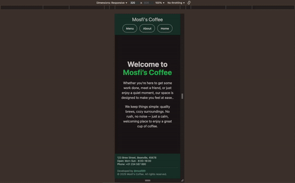

# mosfi's coffee

A landing page, for a coffee place. Dynamic and responsive.

## Tech Stack

- JavaScript (ES6 Modules)
- HTML5
- Webpack
- Tailwind CSS
- DaisyUI

This project helped practice:

- Structuring a multi-page layout using modular JavaScript.
- Using Webpack to bundle JavaScript and assets efficiently.
- Managing project structure and deployment using GitHub Pages.
- Creating responsive and stylish layouts with Tailwind CSS + DaisyUI while also learning how to integrate them into the Webpack bundling configuration.

## Demo:

## Future implementations:

- Order menu (like an eShop)
